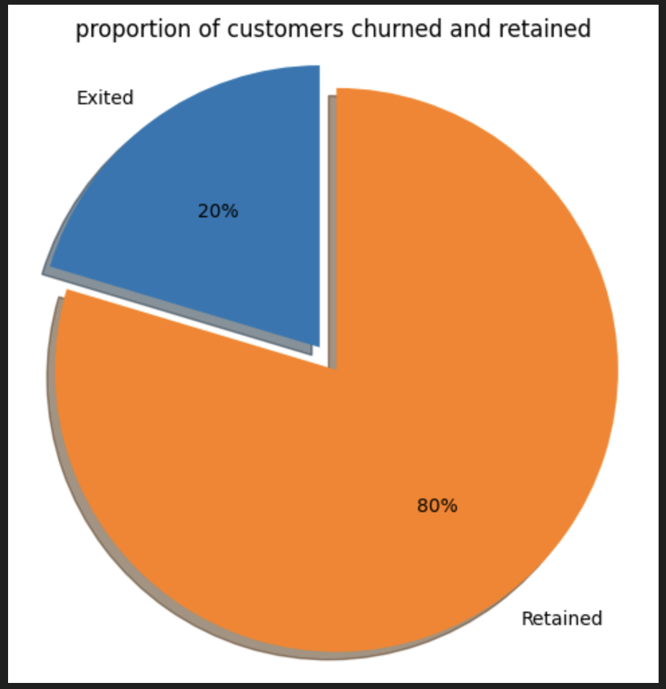
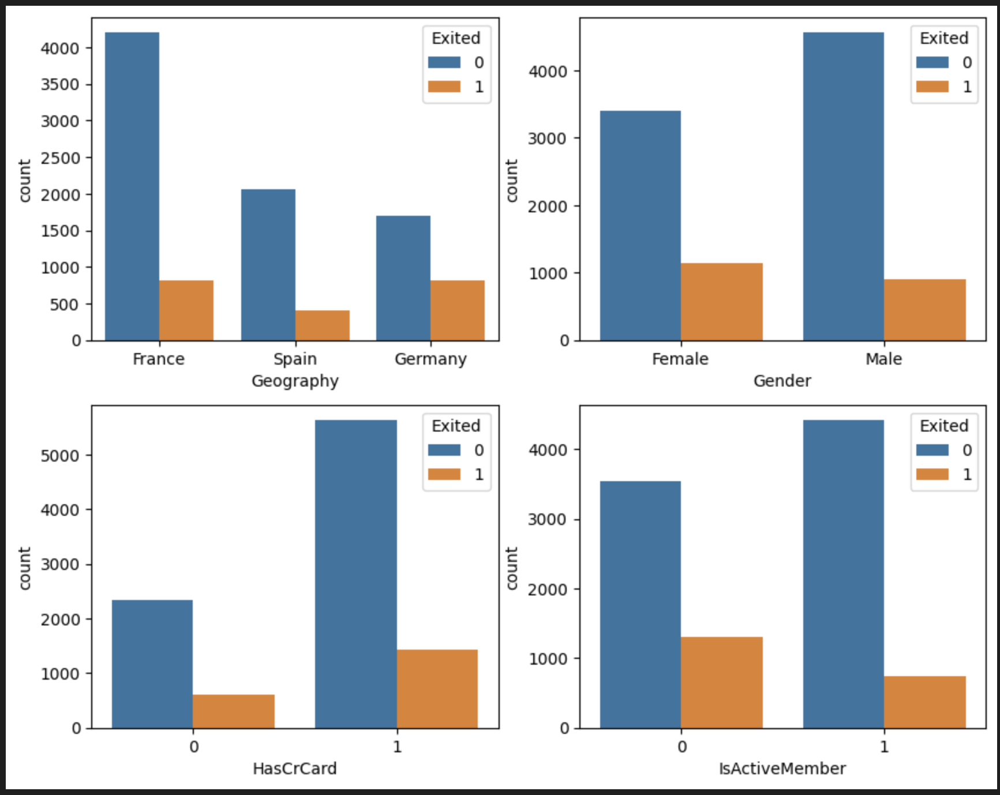
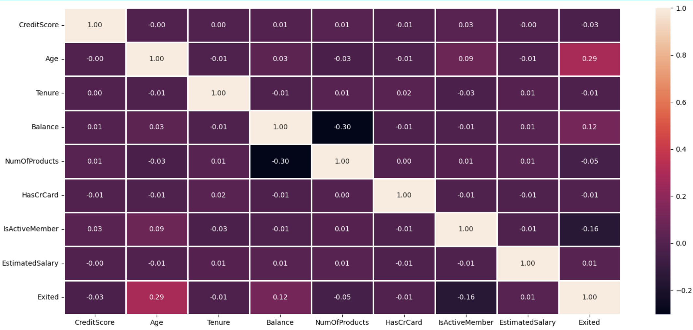
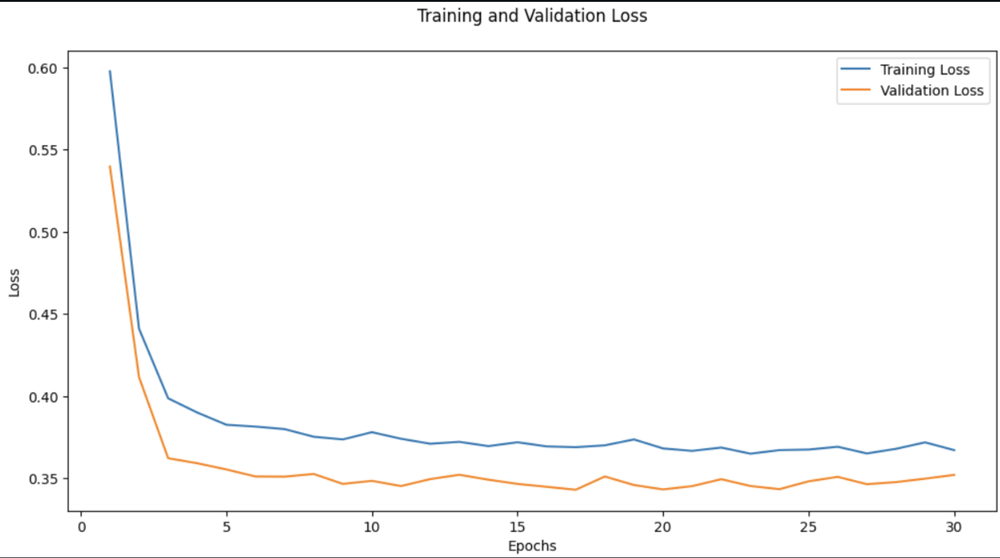
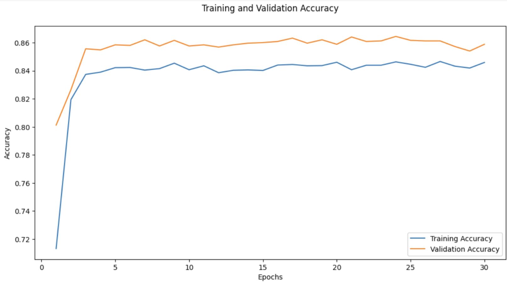

# Customer-Churn-Analysis-in-Banking-with-Artificial-Neural-Networks
This project aims to predict whether a customer will churn (leave the bank) or stay using an Artificial Neural Network (ANN). The dataset used contains various customer attributes and the target variable Exited, indicating whether the customer churned.
## dataset
The dataset contains the following columns:

- **RowNumber** (`int64`)
- **CustomerId** (`int64`)
- **Surname** (`object`)
- **CreditScore** (`int64`)
- **Geography** (`object`)
- **Gender** (`object`)
- **Age** (`int64`)
- **Tenure** (`int64`)
- **Balance** (`float64`)
- **NumOfProducts** (`int64`)
- **HasCrCard** (`int64`)
- **IsActiveMember** (`int64`)
- **EstimatedSalary** (`float64`)
- **Exited** (`int64`, target variable)
  ## Exploratory Data Analysis (EDA)
### Proportion of Customers Who Retained and Churned
A pie chart was created to visualize the proportion of customers who have retained and churned.

### Categorical Variable Analysis
A bar chart was plotted to analyze the categorical variables. Key findings include:

- Most customers are from France, while the majority of customers who churned are from Germany.
- The proportion of female customers who churned is higher than that of male customers.
- Customers with credit cards have a higher churn rate.
- Inactive members have a greater churn rate, and the overall proportion of inactive members is high.

### Correlation Heatmap
A heatmap was plotted to visualize the correlation between various features and the target variable Exited.

```python
import matplotlib.pyplot as plt
import seaborn as sns

df_corr = data_df[['CreditScore', 'Age', 'Tenure', 'Balance', 'NumOfProducts', 'HasCrCard', 'IsActiveMember', 'EstimatedSalary', 'Exited']]

plt.figure(figsize=(18, 8))
corr = df_corr.corr()
sns.heatmap(corr, linewidths=1, annot=True, fmt=".2f")
plt.show()
```
## Model
An Artificial Neural Network (ANN) was used to predict customer churn. The model was built using Keras and consists of the following layers:

Input layer with 10 neurons Hidden layer with 10 neurons, ReLU activation, dropout, and batch normalization Hidden layer with 7 neurons, ReLU activation, dropout, and batch normalization Output layer with 2 neurons, sigmoid activation
### Model Architecture
```python
import keras
from keras.models import Sequential
from keras.layers import Dense, Dropout, BatchNormalization

model = Sequential()

# Adding layer with 10 neurons
model.add(Dense(10, kernel_initializer='normal', activation='relu', input_shape=(10,)))
model.add(Dropout(rate=0.1))
model.add(BatchNormalization())

# Adding another layer with 7 neurons
model.add(Dense(7, kernel_initializer='normal', activation='relu'))
model.add(Dropout(rate=0.1))
model.add(BatchNormalization())

# Adding the output layer with sigmoid activation function
model.add(Dense(2, kernel_initializer='normal', activation='sigmoid'))

# Compiling the model
model.compile(optimizer='adam', loss='binary_crossentropy', metrics=['accuracy'])
```
### Model Training
The model was trained for 30 epochs with a validation split of 20%.
```python
model_history = model.fit(x_train, y_train, validation_split=0.20, validation_data=(x_test, y_test), epochs=30)
```
### Model Evaluation
The accuracy of the model was 85%.
```python
acc = model.evaluate(x_test, y_test)[1]
print(f'Accuracy of model is {acc}')
```
### Visualizing Training and Validation Loss and Accuracy
Training and validation loss and accuracy were plotted to visualize the model's performance.
```python
import matplotlib.pyplot as plt
import seaborn as sns
```
### Visualizing Training and Validation Loss
```python
plt.figure(figsize=(12, 6))
train_loss = model_history.history['loss']
val_loss = model_history.history['val_loss']
epochs = range(1, len(train_loss) + 1)
sns.lineplot(x=epochs, y=train_loss, label='Training Loss')
sns.lineplot(x=epochs, y=val_loss, label='Validation Loss')
plt.title('Training and Validation Loss')
plt.xlabel('Epochs')
plt.ylabel('Loss')
plt.legend()
plt.show()
```

### Visualizing Training and Validation Accuracy
```python
plt.figure(figsize=(12, 6))
train_accuracy = model_history.history['accuracy']
val_accuracy = model_history.history['val_accuracy']
sns.lineplot(x=epochs, y=train_accuracy, label='Training Accuracy')
sns.lineplot(x=epochs, y=val_accuracy, label='Validation Accuracy')
plt.title('Training and Validation Accuracy')
plt.xlabel('Epochs')
plt.ylabel('Accuracy')
plt.legend()
plt.show()
```

### Conclusion
The ANN model achieved an accuracy of 85% in predicting bank customer churn. The model can be further improved by tuning hyperparameters or using more advanced techniques.


